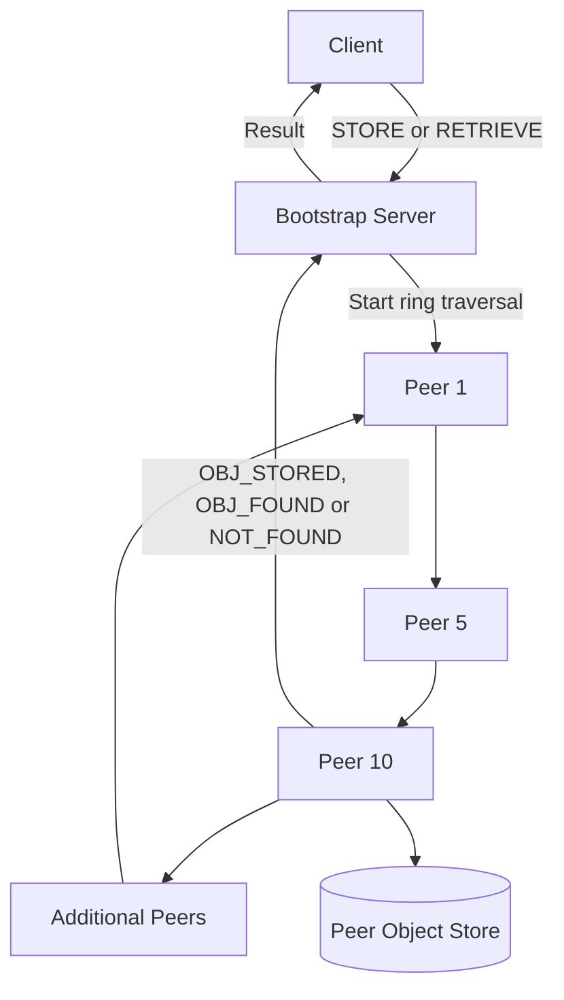

# RingStore DHT

A containerized distributed object store implemented in C++ using TCP sockets, concurrent request handling, persistent storage, and a Chord-inspired peer-to-peer ring.

RingStore DHT demonstrates how distributed hash tables organize nodes, assign ownership of data, and route storage operations across a decentralized network. The system consists of a bootstrap server, dynamically joining peers, and clients that perform `STORE` and `RETRIEVE` operations.

## Key Features

* Dynamic construction of a distributed peer ring
* Chord-style object-to-peer assignment
* Reliable communication over TCP sockets
* Successor-based request routing
* Concurrent connection and shared-state management
* Persistent, peer-specific object storage
* Client and request correlation using unique identifiers
* Docker-based deployment and network isolation
* Docker Compose orchestration for seven-node scenarios
* Reproducible integration tests for joining, storing, and retrieving data

## Architecture



### Bootstrap Server

The bootstrap server is the coordination layer for the network. It:

* Listens for peer and client connections on TCP port `8080`
* Maintains the ordered list of active peers
* Inserts newly joining peers into the correct ring position
* Calculates predecessor and successor relationships
* Sends topology updates to affected peers
* Determines which peer is responsible for an object
* Starts object requests at peer 1
* Correlates peer responses with the originating client connection

The bootstrap server coordinates membership but does not store application objects.

### Peers

Each peer represents a node in the distributed hash table. A peer:

* Has an identifier between `1` and `127`
* Maintains its predecessor and successor
* Joins the network through the bootstrap server
* Receives topology updates when the ring changes
* Forwards requests to its successor
* Stores objects for which it is responsible
* Searches its local object store during retrieval
* Persists records in a peer-specific text file

Objects are represented as:

```text
clientID::objectID
```

Using both values prevents one client from retrieving another client’s object with the same object ID.

### Client

The client communicates exclusively with the bootstrap server. It:

* Establishes a TCP connection to the bootstrap service
* Generates monotonically increasing request IDs
* Submits `STORE` and `RETRIEVE` operations
* Waits for the distributed operation to complete
* Reports one of the following results:

```text
STORED: <objectID>
RETRIEVED: <objectID>
NOT FOUND: <objectID>
```

## Object Placement

Peers and objects use identifiers in the range `1-127`.

An object is assigned to the first peer whose ID is greater than or equal to the object ID. If the object ID is greater than the largest peer ID, ownership wraps around to the first peer in the ring.

For example, consider this ring:

```text
1 → 10 → 50 → 100 → 126 → 1
```

The resulting placement includes:

| Object ID | Responsible Peer |
| --------: | ---------------: |
|         5 |               10 |
|        42 |               50 |
|        75 |              100 |
|       120 |              126 |
|       127 |                1 |

This follows the successor-based ownership model used by Chord-style distributed hash tables.

## Peer Join Process

When a peer joins:

1. The peer resolves the bootstrap server through Docker DNS.
2. It establishes a TCP connection to port `8080`.
3. It sends its peer identifier to the bootstrap server.
4. The bootstrap server locates the insertion point in the ring.
5. The new peer receives its predecessor and successor.
6. The previous and next peers receive updated neighbor information.
7. The bootstrap server prints the updated ring.

If peer `11` joins a ring containing:

```text
2 → 7 → 23 → 56 → 2
```

The updated relationships become:

```text
7 → 11 → 23
```

Only peers `7`, `11`, and `23` require topology updates.

## Request Protocol

Client requests use the following format:

```text
REQUEST:<requestID>,<operation>,<objectID>,<clientID>
```

Example:

```text
REQUEST:1,STORE,42,10
```

The bootstrap server converts the client request into an internal ring message:

```text
RING:<requestID>:<operation>:<objectID>:<clientID>:<responsiblePeer>:<startPeer>
```

Peers return messages such as:

```text
OBJ_STORED:<requestID>:<objectID>:<clientID>:<peerID>
OBJ_FOUND:<requestID>:<objectID>:<clientID>
NOT_FOUND:<requestID>:<objectID>:<clientID>
```

## Store Operation

A `STORE` request follows this sequence:

1. The client sends a request to the bootstrap server.
2. The bootstrap server determines the responsible peer.
3. The request enters the ring at peer 1.
4. Each peer forwards the request to its successor.
5. The responsible peer inserts the `(clientID, objectID)` record.
6. The peer writes its updated object set to disk.
7. The peer sends an `OBJ_STORED` response.
8. The bootstrap server relays the result to the client.

## Retrieve Operation

A `RETRIEVE` request follows this sequence:

1. The client sends a retrieval request to the bootstrap server.
2. The request enters the ring at peer 1.
3. Every visited peer checks for an exact `(clientID, objectID)` match.
4. If a peer finds the record, it returns `OBJ_FOUND`.
5. If the request completes a full traversal, the system returns `NOT_FOUND`.
6. The bootstrap server relays the final result to the client.

## Technology Stack

| Category              | Technology                           |
| --------------------- | ------------------------------------ |
| Programming language  | C++20                                |
| Networking            | POSIX TCP sockets                    |
| Concurrency           | `std::thread` and `std::mutex`       |
| Data structures       | STL vectors, sets, and hash maps     |
| Persistence           | File-backed object stores            |
| Name resolution       | Docker DNS and POSIX networking APIs |
| Containerization      | Docker                               |
| Orchestration         | Docker Compose                       |
| Build automation      | GNU Make                             |
| Operating environment | Ubuntu Linux                         |

## Project Structure

```text
.
├── include/
│   ├── client.h
│   ├── peer.h
│   ├── reciever.h
│   ├── sender.h
│   └── utils.h
├── src/
│   ├── client.cpp
│   ├── reciever.cpp
│   ├── sender.cpp
│   └── utils.cpp
├── main.cpp
├── makefile
├── dockerfile
├── docker-compose-testcase-1.yml
├── docker-compose-testcase-2.yml
├── docker-compose-testcase-3.yml
├── docker-compose-testcase-4.yml
├── docker-compose-testcase-5.yml
├── objects1.txt
├── objects5.txt
├── objects10.txt
├── objects50.txt
├── objects66.txt
├── objects100.txt
└── objects126.txt
```

## Getting Started

### Prerequisites

Install:

* Docker
* Docker Compose
* GNU Make

Verify the installations:

```bash
docker --version
docker compose version
make --version
```

### Clone the Repository

```bash
git clone https://github.com/DanMint/DistributedProj4.git
cd DistributedProj4
```

After renaming the repository:

```bash
git clone https://github.com/DanMint/RingStore-DHT.git
cd RingStore-DHT
```

### Build the Docker Images

```bash
make Build-Images
```

This produces images for the three process roles:

```text
prj5-bootstrap
prj5-peer
prj5-client
```

All roles use the same compiled C++ executable. The container hostname determines whether the process starts as the bootstrap server, a peer, or the client.

## Running the Scenarios

### Scenario 1: Sequential Peer Joins

Adds peers in increasing identifier order and verifies ring construction.

```bash
make Run-Testcase1
```

### Scenario 2: Non-Sequential Peer Joins

Adds peers in a different order to verify that ring placement does not depend on startup order.

```bash
make Run-Testcase2
```

### Scenario 3: Store an Object

Routes a `STORE` request through the ring and persists it on the responsible peer.

```bash
make Run-Testcase3
```

Expected client output includes:

```text
STORED: 42
```

### Scenario 4: Retrieve an Existing Object

Searches the ring for a previously stored client/object record.

```bash
make Run-Testcase4
```

Expected client output includes:

```text
RETRIEVED: 45
```

### Scenario 5: Retrieve a Missing Object

Traverses the complete ring when the requested record does not exist.

```bash
make Run-Testcase5
```

Expected client output includes:

```text
NOT FOUND: 999
```

## Stopping a Scenario

Use the matching Compose file to stop and remove its containers:

```bash
docker compose -f docker-compose-testcase-1.yml down
```

Change the scenario number as needed.

To rebuild after changing the source:

```bash
make Build-Images
```

## Concurrency and State Management

The bootstrap server may manage multiple peer and client connections simultaneously. Shared state is protected using mutexes, including:

* The peer ring
* Peer-to-socket mappings
* Request-to-client mappings
* Peer object stores

The system uses request identifiers to associate asynchronous peer responses with the correct client connection.

## Engineering Concepts Demonstrated

This project demonstrates practical experience with:

* Distributed system architecture
* Distributed hash tables
* Chord-style ring topology
* Peer-to-peer routing
* TCP client/server programming
* Custom application-level protocols
* Concurrent C++ programming
* Shared-state synchronization
* File-backed persistence
* Docker networking
* Multi-container orchestration
* Integration and scenario testing

## Current Scope and Limitations

RingStore DHT focuses on the fundamental mechanics of ring formation, routing, storage, and retrieval.

The current implementation assumes:

* Peers do not fail after joining
* TCP communication remains reliable
* A maximum of seven peers is used
* Peer and object IDs are supplied directly
* Objects contain identifiers rather than binary payloads

The system does not currently implement:

* Finger tables or logarithmic Chord routing
* Replication
* Failure detection or heartbeats
* Automatic failover
* Object migration after membership changes
* Peer removal
* Authentication or encrypted transport
* Persistent bootstrap metadata

These features provide clear opportunities for future development.

## Potential Improvements

* Add finger tables for logarithmic request routing
* Replicate objects across multiple successor peers
* Add peer health monitoring and failure recovery
* Support graceful peer departure
* Rebalance stored objects after membership changes
* Introduce message framing and structured serialization
* Add TLS-encrypted peer communication
* Add unit and integration tests to a CI pipeline
* Export routing latency and peer health metrics
* Support arbitrary object payloads

## Author

**Daniel Mints**

* GitHub: [DanMint](https://github.com/DanMint)
* Project: [RingStore DHT](https://github.com/DanMint/DistributedProj4)
